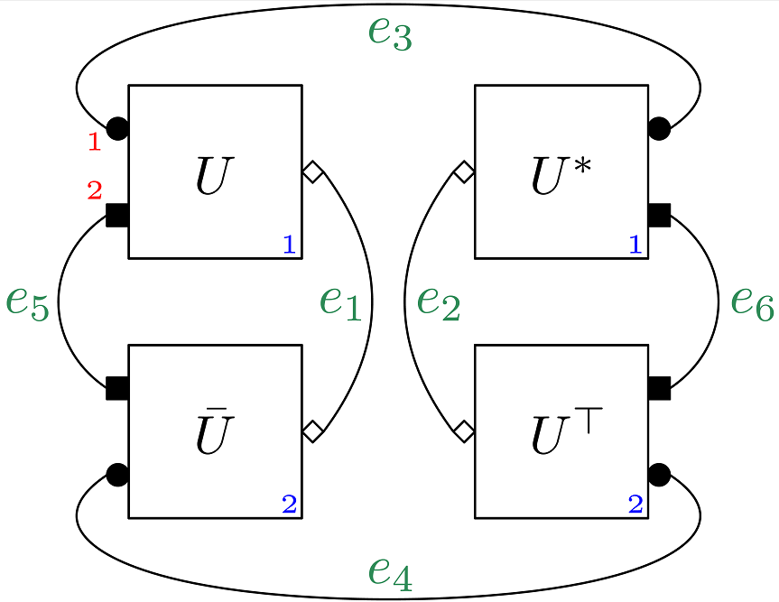

# RTNI - A SYMBOLIC INTEGRATOR FOR HAAR-RANDOM TENSOR NETWORKS

RTNI is symbolic computer algebra package for MATHEMATICA and PYTHON.  It computes averages of tensor networks containing multiple Haar-distributed random unitary matrices and symbolic tensors.  Such tensor networks are represented as multigraphs, with vertices  corresponding to tensors or random unitaries and edges corresponding to tensor contractions. Input and output spaces of random unitaries may be subdivided into arbitrary tensor factors, with dimensions treated symbolically. The algorithm implements the graphical Weingarten calculus and produces a weighted sum of tensor networks representing the average over the unitary group. Associated visualization routines are also provided. 

A detailed description of the functionality of this package with examples of its usage is available at [arXiv:paper](https://arxiv.org/abs/1902.08539).

### MATHEMATICA

* Follow the [RTNI setup guide for MATHEMATICA](gettingstarted_MATHEMATICA.md) to setup RTNI.
* Look at the [list of files and sample code for MATHEMATICA](MATHEMATICA/README.md)

### PYTHON

* Follow the [RTNI setup guide for PYTHON](gettingstarted_PYTHON.md) to setup  RTNI.
* Look at the [list of files and sample code for PYTHON](PYTHON/README.md)

### LICENSE
This project is licensed under the terms of the [GNU GENERAL PUBLIC LICENSE v3.0](LICENSE.txt). When using this software, please include the following reference (also in [BibTeX](reference.bib) format)

* Motohisa Fukuda, Robert König, and Ion Nechita. RTNI - A symbolic integrator for Haar-random tensor networks. [arXiv:1902.08539](https://arxiv.org/abs/1902.08539).
